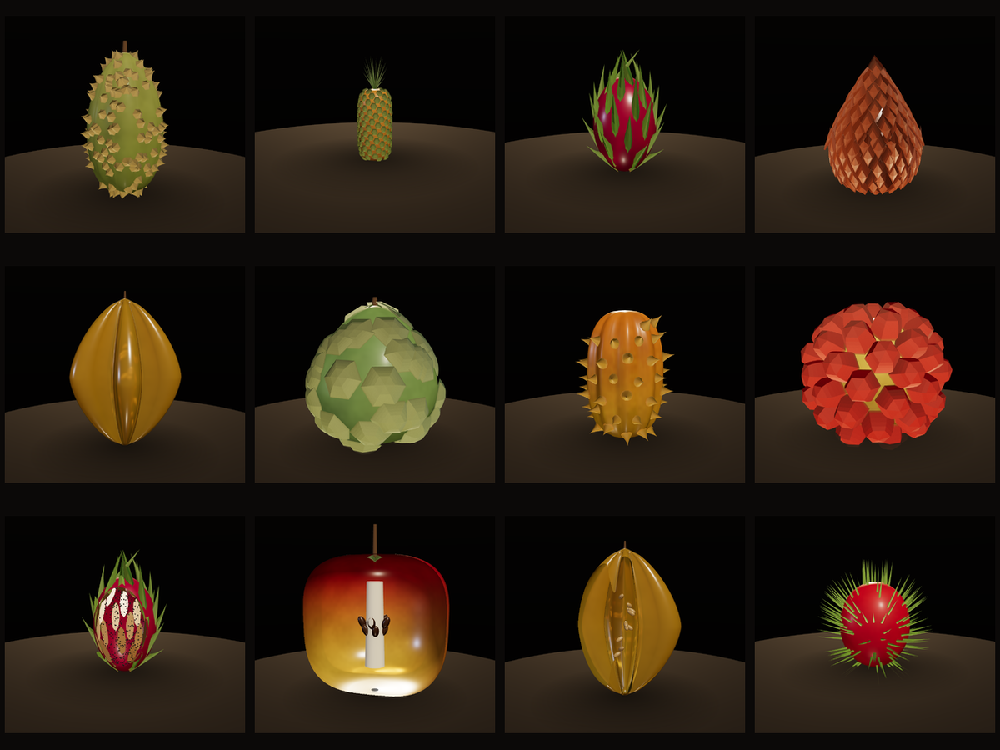

# 🍈 Fruit — a parameterized morphospace

**Live: [fruit.exe.xyz](https://fruit.exe.xyz)**



A real-time, procedurally generated fruit. Not a model of *a* fruit — a model of the
**space** of possible fruit, with sliders for the axes botany actually varies: how
spiky, how long, how many nodules, how scaly, how many seeds and where.

The flesh is semi-transparent and the fruit slices open, because the seeds are the
point. A fruit is, after all, mostly a strategy for moving seeds around.

Sibling project to the [fish rig](https://marine.exe.xyz) — same idea (a creature
*is* its parameter tree, and the tree fits in a URL), completely different anatomy.

```sh
npm install
npm start          # http://localhost:5174
npm run smoke      # headless geometry checks — every preset + every morph
npm run gallery    # render a plate per species into examples/ (needs npm start)
npm run interior   # render the cut-open plates
npm run build      # bundle to dist/
```

## The idea

A fish is a spine with a swim cycle. A fruit has neither, and forcing it into that
shape would have been the wrong abstraction. What a fruit *is*, structurally, is a
**body of revolution wearing three independent fields**:

| field | what it is | the fruit it makes |
|---|---|---|
| **profile** | two superellipse end-caps meeting at the widest point | sphere → pear → cucumber → chilli |
| **ribs** | angular modulation, `r · (1 + d·cos(kθ))` | 5 deep ribs = carambola's star; 8 shallow = a ribbed pumpkin |
| **features** | discrete solids scattered on the rind | durian's spines, pineapple's fruitlets, salak's scales |
| **rind** | isotropic noise | bitter melon's warts, a cantaloupe's netting |
| **seeds** | a volumetric arrangement inside | the payoff, visible through the flesh |

The interesting fruit are the ones that turn on an *unlikely combination*. Bitter
melon really is ribs **and** warts at once. A durian is a five-carpel body under a
blue-noise field of hexagonal pyramids. What's fun is what lies *between* the
presets — which is what the blend slider is for.

## One feature, many fruit

The central bet: a durian's spine, a cherimoya's areole, a pineapple's fruitlet, a
salak's scale and a rambutan's hair are **the same object with different numbers in
it**. Six knobs carry it across the whole space:

- **`sharp`** — tip profile, `r(s) = (1-s)^sharp`. `0.3` a swollen dome (lychee
  tubercle) · `1` a cone · `2.5` a concave needle (durian).
- **`sides`** — `4–6` a faceted pyramid or hexagon (durian spines and pineapple
  fruitlets are both hexagonal, because both are close-packed on a surface) ·
  `16+` a smooth cone or hair.
- **`elong`** — draw the footprint out along the axis, and a bump becomes a scale.
- **`tilt`** — lean off the normal. Positive lifts the tip toward the crown (dragon
  fruit's bracts); **negative lays the plates back so they overlap like roof tiles**,
  which is what makes a snake fruit read as *reptilian* rather than merely bumpy.
- **`curve`** — recurve the tip into a hook. A soursop's "spines" aren't spines at
  all — they're the soft persistent tips of its carpels, and every one hooks toward
  the apex. That hook is its whole character.
- **`latGrad`** — size as a function of latitude. A cherimoya is mammillate at the
  base and flattens to shields at the apex.

## Arrangement is not one thing

The easy thing to get wrong, and the research that changed the design:

- **spiral** — golden-angle phyllotaxis (137.508°). Correct **only** where the
  surface units grew from organ primordia on a meristem: a pineapple's fruitlets, a
  dragon fruit's bracts, a salak's scales. On a barrel this reproduces the real
  Fibonacci parastichies — the **8/13/21** spirals you can count on an actual
  pineapple — for free, and it's *why* a fruitlet is a hexagon: three spiral
  families crossing gives six neighbours.
- **scatter** — blue-noise packing, **not** a spiral. A durian's spines are
  epidermal outgrowths of the husk and a lychee's tubercles are peel, so neither
  inherits a meristem's spiral. They pack evenly with no long-range order.
- **rows** — features ranked along the ribs, like a kiwano's horns.

In every mode the points are spaced by equal **area**, not equal parameter —
otherwise an elongated fruit ends up with a bald belly and a thicket at each pole.

## The interior

Seven archetypes, selectable, and visible through the translucent flesh (drag
**✂ slice open**):

`pit` a drupe's single stone (bigger than you think — an avocado's is ~45% of the
fruit's diameter) · `core` a pome's cluster of pips on a five-carpel star · `radial`
citrus locules · `ring` a kiwi's annulus around a pale columella · `dispersed` a
dragon fruit's thousand specks · `cavity` a melon's hollow · **`follow`** — one seed
beneath each surface feature.

That last one is the botanically lovely case. In an aggregate fruit — cherimoya,
soursop, jackfruit — every surface areole **is** one carpel, and each carpel holds
one seed. The rind's point set and the seed's point set are *the same set*, so the
code computes it once and hands it to both.

## Sharing

Every fruit is a URL. The hash encodes the preset (or morph pair) plus only the
leaves you actually changed, so a typical link is under 100 characters:

```
fruit.exe.xyz/#fruit=durian~features.count=310~ribs.depth=0.3
fruit.exe.xyz/#fruit=durian:pineapple:0.35
```

Hand-sculpted fruit that don't compress fall back to a deflate-compressed full tree.
(Same codec as the fish rig; it's general over any parameter tree.)

## Layout

```
src/core/math.js        phyllotaxis, equal-area scattering, noise, tree blending
src/core/params.js      the parameter tree — a fruit IS this
src/geom/surface.js     profile + ribs + rind → the body
src/geom/features.js    spikes/nodules/scales, and where they land
src/geom/seeds.js       the seven interior archetypes
src/geom/parts.js       crown, stem, calyx
src/shading/materials.js  transmissive flesh, gradient rind
src/species/presets.js  16 fruit chosen to span the space, not the supermarket
src/genome.js           fruit ⇄ URL
```

## Accuracy

Numbers are real where the botany gave real ones — durian spines are 0.7–1.7 cm on a
~7.5 cm radius and sit on hexagonal bases; a dragon fruit averages 39 bracts; a
pineapple is 100–200 fruitlets. Colours are calibrated from reference imagery, not
measured. Where the model approximates, it says so in the source: Buddha's hand is
*really* carpels that failed to fuse, and is faked here with ribs deep enough to
nearly pinch through; a cantaloupe's netting is *really* a suberised crack network,
and is faked with ridged noise.

See [ROADMAP.md](ROADMAP.md) for what's next.
